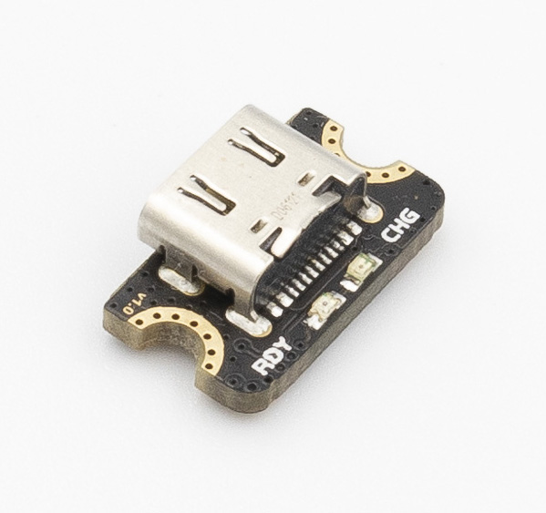
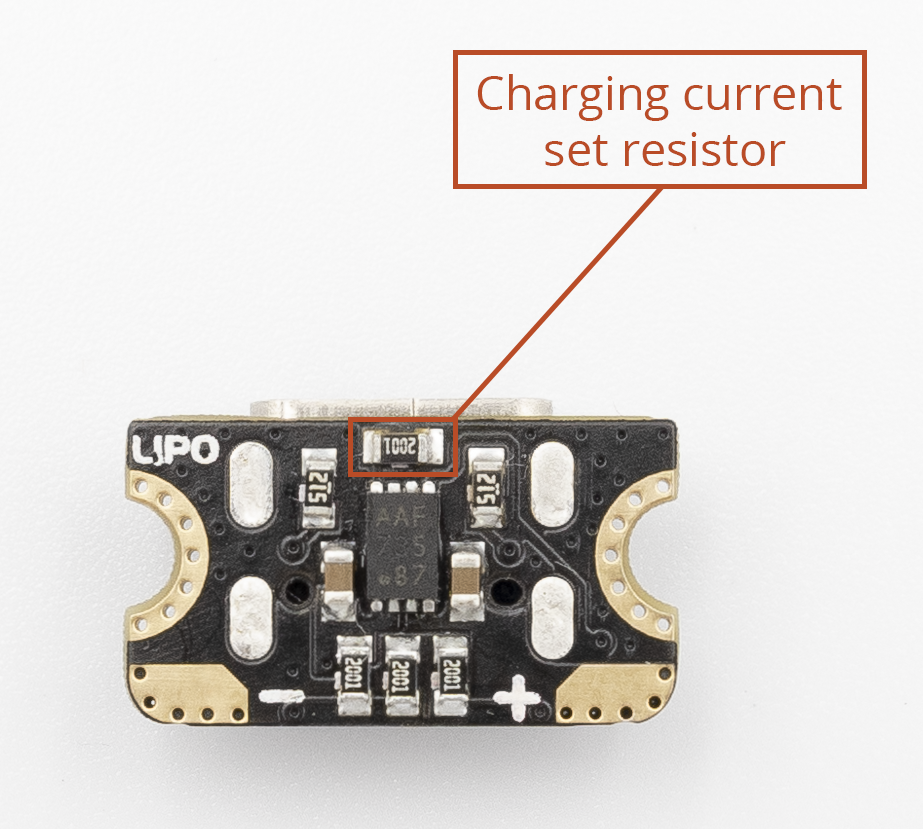

[![CC BY-SA 4.0][cc-by-sa-shield]][cc-by-sa]

# Ant2 USB-C LiPo Charger



Ant2 is a tiny USB-C LiPo charger, measuring just 16 x 9 mm in footprint, barely larger than the USB-C connector itself. It is the smallest charger in it's category. Ant2 can be used to add USB-C power and battery charging support to your space constrained prototypes and projects. The tiny size also makes it easier to retrofit the USB-C power into your older projects.

### Reduced thermal throttling

Ant2 uses a popular Microchip MCP73831 in a DFN package, which reduces thermal throttling. The more common SOT-23-5 package has a thermal performance about three times worse than that of DFN. Thermal throttling increases the charging time because of the reduced charging current. By improving the thermal performance the risk of increased charging time is reduced.

## Convenient mounting

Despite its tiny size, Ant2 can be mounted using regular M3 or M2.5 screws. Two half-cut mounting holes on each side provide a compact but still reliable mounting.

## Features & Specifications

- **Maximum charging current:** 500 mA
- **Charging voltage:** 4.20 V
- **Status indication:**
	- red - charging
	- green - charged
- **Size:** 16mm x 9mm x 6mm
- High quality USB-C connector from Japan Electronics Aviation

## Changing the charging current



It is possible to easily change the charging current by replacing the charging current set resistor. The resistor value is calculated using the following equation:
```
R = 1000/I
```
To make it easier to select the resistor value, some values are precalculated in the table below. The `Ideal resisor` column lists the calculated resistor values. Since it is not possible to buy resistor of any arbitrary value, there is an additional column which provides closest E24 and E48 series standard resistor values. The `Actual current` column calculates the charging current based on the selected E24/E48 resistor.

| Charging current, mA | Ideal resistor, kOhm | Closest E24/E48 resistor, kOhm | Actual current, mA |
|-----------------|-----------------------|---------------------------|-|
| 500 | 2.00  | 2.00 | 500
| 400 | 2.50  | 2.49 | 402
| 350 | 2.86  | 2.87 | 348
| 300 | 3.33  | 3.32 | 301
| 250 | 4.00  | 4.02 | 249
| 200 | 5.00  | 5.11 | 196
| 150 | 6.66  | 6.49 | 154
| 100 | 10.00 | 10.0 | 100
| 75  | 13.33 | 13.3 | 75
| 50  |	20.00 | 20.0 | 50
| 40  |	25.00 | 24.9 | 40
| 30  |	33.33 | 33.2 | 30
| 20  |	50.00 | 51.1 | 20

## Notes

The USB-C connector is not included in the design or STEP files, because the license provided by JAE doesn't allow sharing their STEP files. However, their STEP file can be acquired [here](https://www.jae.com/en/connectors/series/detail/product/id=91780).

This work is licensed under a
[Creative Commons Attribution-ShareAlike 4.0 International License][cc-by-sa].

[![CC BY-SA 4.0][cc-by-sa-image]][cc-by-sa]

[cc-by-sa]: http://creativecommons.org/licenses/by-sa/4.0/
[cc-by-sa-image]: https://licensebuttons.net/l/by-sa/4.0/88x31.png
[cc-by-sa-shield]: https://img.shields.io/badge/License-CC%20BY--SA%204.0-lightgrey.svg
